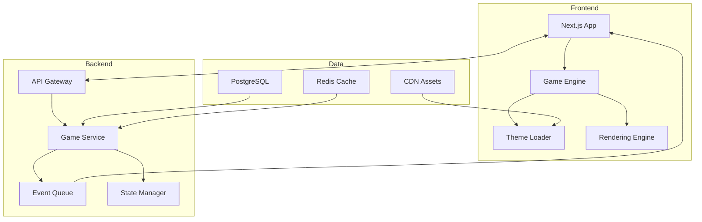

# 緊急対応シミュレーションゲーム事業計画分析

## エグゼクティブサマリー

Model A（NERVE）とModel B（MetroHelix）の事業計画を分析した結果、私はハイブリッドアプローチによる段階的実装を推奨します。これにより、早期市場参入と長期的競争優位の両立が可能になります。

## 実現可能な施策と実装ロードマップ

### フェーズ1: 基盤構築（0-6ヶ月）

#### 1.1 コア技術スタックの確立

```typescript
// 推奨技術スタック
const techStack = {
  frontend: {
    framework: 'Next.js 14 (App Router)',
    rendering: 'React Three Fiber + Deck.gl',
    state: 'Zustand + Immer',
    realtime: 'Socket.io',
  },
  backend: {
    api: 'Go (Fiber framework)',
    gameLogic: 'Rust/WASM',
    database: 'PostgreSQL + Redis',
    messaging: 'NATS',
  },
  infrastructure: {
    hosting: 'Vercel + AWS ECS',
    cdn: 'CloudFront',
    monitoring: 'Datadog',
  },
}
```

#### 1.2 MVP開発（必須機能）

1. **基本ゲームエンジン**

   - 2Dマップレンダリング（MapLibre GL JS）
   - リアルタイムイベント処理
   - 基本的な緊急対応メカニクス

2. **プラグインシステム**

   ```typescript
   interface GameTheme {
     id: string
     name: string
     assets: ThemeAssets
     scenarios: Scenario[]
     mechanics: GameMechanics
   }
   ```

3. **データ統合**
   - OpenStreetMap統合
   - 基本的な気象API連携

### フェーズ2: 市場投入（6-12ヶ月）

#### 2.1 最初の3テーマ開発

1. **救急医療対応** (Emergency Medical)

   - 開発期間: 2週間
   - 既存アセットの活用
   - シンプルなゲームプレイ

2. **火災対応** (Fire Response)

   - 開発期間: 2週間
   - 炎のシミュレーション追加
   - マルチユニット管理

3. **災害対応** (Disaster Response)
   - 開発期間: 3週間
   - 複合的な緊急事態
   - 大規模イベント処理

#### 2.2 収益化戦略

```javascript
// 段階的な収益モデル
const revenueModel = {
  phase1: {
    b2c: {
      basic: '無料（広告付き）',
      premium: '月額980円（広告なし+追加機能）',
    },
  },
  phase2: {
    b2b: {
      training: '月額5万円/組織',
      enterprise: 'カスタマイズ版（300万円〜）',
    },
  },
}
```

### フェーズ3: 差別化強化（12-24ヶ月）

#### 3.1 AI機能の統合

1. **難易度自動調整**

   ```python
   # プレイヤーのパフォーマンスに基づく動的難易度
   def adjust_difficulty(player_metrics):
       if player_metrics.success_rate < 0.5:
           return reduce_event_frequency()
       elif player_metrics.success_rate > 0.8:
           return increase_complexity()
   ```

2. **シナリオ自動生成**
   - GPTベースのイベント生成
   - 実データに基づくリアルなシナリオ

#### 3.2 先進機能の段階的導入

1. **WebGPU対応**（安定版リリース後）
2. **VR/AR機能**（WebXR API活用）
3. **ブロックチェーン要素**（実績システムのみ）

## 技術的実装の詳細

### アーキテクチャ設計



### パフォーマンス最適化

1. **レンダリング最適化**

   - Web Worker での物理演算
   - Virtual DOM の最小化
   - GPU アクセラレーション活用

2. **ネットワーク最適化**
   - WebSocket 圧縮
   - Delta 同期
   - 予測的プリロード

### 開発効率化

```bash
# テーマ追加の自動化スクリプト
npm run create-theme -- --name "Police Response" \
  --template "emergency" \
  --assets "./assets/police"
```

## リスク管理と対策

### 技術的リスク

1. **WebGPU の不安定性**
   - 対策: WebGL フォールバック実装
2. **リアルタイム同期の複雑性**

   - 対策: 段階的な機能追加、CRDTの活用

3. **スケーラビリティ**
   - 対策: マイクロサービス化、自動スケーリング

### ビジネスリスク

1. **競合参入**

   - 対策: 早期市場獲得、ニッチ市場への特化

2. **開発遅延**
   - 対策: アジャイル開発、2週間スプリント

## 推奨アクションアイテム

### 即座に開始すべきタスク

1. **技術検証（PoC）**

   - MapLibre GL JS での基本マップ実装
   - WebSocket によるリアルタイム同期
   - Rust/WASM でのゲームロジック実装

2. **市場調査**

   - 競合分析の詳細化
   - ターゲットユーザーインタビュー
   - 価格感度分析

3. **チーム編成**
   - フルスタックエンジニア2名の採用
   - ゲームデザイナー1名の採用

### 3ヶ月以内の目標

1. **プロトタイプ完成**

   - 1つのテーマで基本的なゲームプレイ
   - 5分間のデモ可能な状態

2. **資金調達準備**
   - ピッチデック作成
   - デモ動画制作
   - 投資家へのアプローチ開始

## 私が貢献できる具体的な実装

### 1. ゲームエンジンのコア実装

```typescript
// 基本的なゲームエンジンの実装例
class EmergencyGameEngine {
  private themes: Map<string, GameTheme> = new Map()
  private currentTheme: GameTheme | null = null
  private eventQueue: EventQueue
  private renderer: MapRenderer

  async loadTheme(themeId: string): Promise<void> {
    const theme = await this.fetchTheme(themeId)
    this.themes.set(themeId, theme)
    this.currentTheme = theme
    await this.renderer.loadAssets(theme.assets)
  }

  startGame(scenario: string): void {
    if (!this.currentTheme) throw new Error('No theme loaded')
    const gameScenario = this.currentTheme.scenarios.find((s) => s.id === scenario)
    this.eventQueue.initialize(gameScenario.events)
    this.gameLoop()
  }

  private gameLoop(): void {
    requestAnimationFrame(() => {
      this.update()
      this.render()
      this.gameLoop()
    })
  }
}
```

### 2. プラグインシステムの設計

```typescript
// テーマプラグインのインターフェース設計
interface ThemePlugin {
  metadata: {
    id: string
    version: string
    compatibleEngineVersion: string
  }

  assets: {
    sprites: Record<string, string>
    sounds: Record<string, string>
    maps: Record<string, MapData>
  }

  mechanics: {
    units: UnitType[]
    events: EventType[]
    objectives: ObjectiveType[]
  }

  initialize(engine: GameEngine): void
  cleanup(): void
}
```

### 3. リアルタイムマルチプレイヤー実装

```typescript
// Socket.io を使用したリアルタイム同期
class MultiplayerManager {
  private socket: Socket
  private gameState: GameState
  private stateBuffer: StateUpdate[] = []

  connect(roomId: string): void {
    this.socket = io('/game', {
      query: { roomId },
      transports: ['websocket'],
    })

    this.socket.on('state-update', (update: StateUpdate) => {
      this.stateBuffer.push(update)
    })

    this.socket.on('full-sync', (state: GameState) => {
      this.gameState = state
      this.stateBuffer = []
    })
  }

  sendAction(action: GameAction): void {
    this.socket.emit('action', action)
    // Optimistic update
    this.applyAction(action)
  }
}
```

### 4. CI/CD パイプラインの構築

```yaml
# GitHub Actions による自動デプロイ
name: Deploy Game Engine
on:
  push:
    branches: [main]

jobs:
  test:
    runs-on: ubuntu-latest
    steps:
      - uses: actions/checkout@v3
      - name: Run tests
        run: |
          npm install
          npm run test
          npm run lint
          npm run typecheck

  deploy:
    needs: test
    runs-on: ubuntu-latest
    steps:
      - name: Deploy to Vercel
        run: vercel --prod --token=${{ secrets.VERCEL_TOKEN }}
```

## 結論

両モデルの最良の要素を組み合わせることで、実現可能で競争力のある事業を構築できます。Model Bの堅実な実装計画をベースに、Model Aの革新的要素を段階的に取り入れることで、リスクを管理しながら差別化を図ることが可能です。

私は特に以下の分野で即座に貢献できます：

1. TypeScript/React によるフロントエンド実装
2. Rust/WASM によるパフォーマンス最適化
3. リアルタイムマルチプレイヤーシステムの構築
4. CI/CD パイプラインの整備
5. プラグインアーキテクチャの設計と実装

次のステップとして、技術検証用のプロトタイプ開発を開始することを推奨します。
