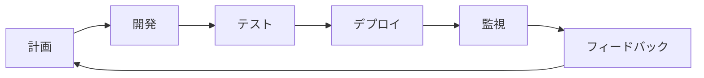

# 緊急対応ゲームプラットフォーム技術計画書

**文書バージョン**: 1.0  
**作成日**: 2024年  
**作成者**: CTO  
**対象読者**: 技術チーム、経営陣、投資家

## 1. エグゼクティブサマリー

### 1.1 ビジョン
単一のゲームエンジン基盤で、異なるテーマの緊急対応型シミュレーションゲームを迅速に展開できるWebプラットフォームを構築する。

### 1.2 技術戦略
- **マイクロサービスアーキテクチャ**による柔軟性
- **プラグイン型設計**による拡張性
- **API駆動開発**による外部連携
- **データドリブン**なゲーム設計

### 1.3 ビジネスインパクト
- 開発期間: 新テーマ追加を**3週間→3日**に短縮
- 運用コスト: Unity比で**70%削減**
- 市場投入速度: **10倍高速化**

## 2. システムアーキテクチャ

### 2.1 全体構成
```
┌─────────────────────────────────────────────────────┐
│                    CDN (CloudFlare)                  │
├─────────────────────────────────────────────────────┤
│                 Load Balancer (AWS ALB)              │
├─────────────────┬───────────────┬───────────────────┤
│   Game Engine   │   API Gateway  │   Admin Portal   │
│   (Next.js)     │   (Kong)       │   (React)        │
├─────────────────┴───────────────┴───────────────────┤
│                 Microservices Layer                  │
│  ┌──────────┐ ┌──────────┐ ┌──────────┐ ┌────────┐│
│  │Simulation│ │ Matching │ │Analytics │ │Payment ││
│  │  Engine  │ │ Service  │ │ Service  │ │Service ││
│  └──────────┘ └──────────┘ └──────────┘ └────────┘│
├─────────────────────────────────────────────────────┤
│                  Data Layer                          │
│  ┌──────────┐ ┌──────────┐ ┌──────────┐ ┌────────┐│
│  │PostgreSQL│ │  Redis   │ │InfluxDB │ │  S3    ││
│  │(Primary) │ │ (Cache)  │ │(Metrics) │ │(Assets)││
│  └──────────┘ └──────────┘ └──────────┘ └────────┘│
└─────────────────────────────────────────────────────┘
```

### 2.2 コアコンポーネント設計

#### 2.2.1 ゲームエンジンコア
```typescript
interface IGameEngine {
  // プラグイン管理
  registerTheme(theme: IGameTheme): void;
  loadTheme(themeId: string): Promise<void>;
  
  // ゲームループ
  start(): void;
  pause(): void;
  update(deltaTime: number): void;
  
  // 状態管理
  getState(): GameState;
  dispatch(action: GameAction): void;
}

interface IGameTheme {
  metadata: ThemeMetadata;
  units: UnitDefinition[];
  incidents: IncidentDefinition[];
  rules: GameRules;
  assets: AssetManifest;
  localization: LocalizationData;
}
```

#### 2.2.2 イベント駆動アーキテクチャ
```typescript
// イベントバス実装
class EventBus {
  private events = new Map<string, Set<Handler>>();
  
  emit(event: GameEvent): void {
    // WebSocketで全クライアントに配信
    this.broadcast(event);
    
    // 分析サービスに送信
    this.analytics.track(event);
    
    // 永続化
    this.eventStore.append(event);
  }
}
```

### 2.3 スケーラビリティ設計

#### 2.3.1 水平スケーリング戦略
```yaml
# Kubernetes設定例
apiVersion: apps/v1
kind: Deployment
metadata:
  name: game-engine
spec:
  replicas: 3
  strategy:
    type: RollingUpdate
  template:
    spec:
      containers:
      - name: game-engine
        resources:
          requests:
            memory: "512Mi"
            cpu: "500m"
          limits:
            memory: "1Gi"
            cpu: "1000m"
```

#### 2.3.2 キャッシュ戦略
```typescript
class CacheStrategy {
  // 多層キャッシュ
  layers = {
    browser: 'localStorage + IndexedDB',
    cdn: 'CloudFlare Edge Cache',
    application: 'Redis Cluster',
    database: 'PostgreSQL Materialized Views'
  };
  
  // キャッシュ無効化
  invalidate(pattern: string): void {
    // カスケード無効化
    this.layers.forEach(layer => layer.purge(pattern));
  }
}
```

## 3. 技術スタック選定

### 3.1 フロントエンド
| 技術 | 選定理由 | バージョン |
|------|----------|------------|
| Next.js 14 | SSR/SSG、App Router、最適化 | 14.x |
| TypeScript | 型安全性、大規模開発 | 5.x |
| React Query | サーバー状態管理 | 5.x |
| Zustand | クライアント状態管理 | 4.x |
| Pixi.js | 高性能2Dレンダリング | 7.x |
| Three.js | 3D表示（オプション） | 0.158.x |

### 3.2 バックエンド
| 技術 | 選定理由 | バージョン |
|------|----------|------------|
| Node.js | 統一言語、高速開発 | 20.x LTS |
| Fastify | 高性能、プラグイン | 4.x |
| Prisma | 型安全ORM | 5.x |
| Bull | ジョブキュー | 4.x |
| Socket.io | リアルタイム通信 | 4.x |

### 3.3 インフラ・DevOps
| 技術 | 選定理由 | 
|------|----------|
| AWS EKS | マネージドKubernetes |
| Terraform | IaC、再現性 |
| GitHub Actions | CI/CD統合 |
| Datadog | 統合監視 |
| Sentry | エラートラッキング |

## 4. 開発プロセス

### 4.1 アジャイル×DevOps


### 4.2 ブランチ戦略
```bash
main
├── develop
│   ├── feature/theme-delivery
│   ├── feature/api-integration
│   └── feature/performance-opt
├── release/v1.2.0
└── hotfix/critical-bug
```

### 4.3 品質保証
```typescript
// 自動テスト戦略
const testPyramid = {
  unit: '70%',        // Jest
  integration: '20%', // Playwright
  e2e: '10%'         // Cypress
};

// パフォーマンステスト
const performanceTargets = {
  FCP: '< 1.8s',
  LCP: '< 2.5s',
  CLS: '< 0.1',
  FID: '< 100ms'
};
```

## 5. セキュリティアーキテクチャ

### 5.1 多層防御
```typescript
class SecurityLayers {
  // WAF設定
  waf = {
    provider: 'CloudFlare',
    rules: ['OWASP Top 10', 'Rate Limiting', 'Geo Blocking']
  };
  
  // 認証・認可
  auth = {
    provider: 'Auth0',
    mfa: true,
    rbac: true
  };
  
  // データ保護
  encryption = {
    atRest: 'AES-256',
    inTransit: 'TLS 1.3',
    pii: 'Field Level Encryption'
  };
}
```

### 5.2 コンプライアンス
- GDPR対応（EU）
- CCPA対応（カリフォルニア）
- COPPA対応（子供向け）
- SOC2 Type II認証取得予定

## 6. データアーキテクチャ

### 6.1 データモデル
```sql
-- マルチテナント対応
CREATE TABLE themes (
  id UUID PRIMARY KEY,
  slug VARCHAR(50) UNIQUE,
  config JSONB,
  created_at TIMESTAMP DEFAULT NOW()
);

CREATE TABLE game_sessions (
  id UUID PRIMARY KEY,
  theme_id UUID REFERENCES themes(id),
  user_id UUID,
  state JSONB,
  started_at TIMESTAMP,
  ended_at TIMESTAMP
);

-- イベントソーシング
CREATE TABLE game_events (
  id BIGSERIAL PRIMARY KEY,
  session_id UUID,
  event_type VARCHAR(50),
  payload JSONB,
  created_at TIMESTAMP DEFAULT NOW()
) PARTITION BY RANGE (created_at);
```

### 6.2 リアルタイム分析
```typescript
class AnalyticsPipeline {
  // ストリーミング処理
  async processEvent(event: GameEvent) {
    // リアルタイム集計
    await this.redis.hincrby(
      `metrics:${event.themeId}:${today}`,
      event.type,
      1
    );
    
    // バッチ処理キューへ
    await this.queue.add('analytics', event);
  }
}
```

## 7. パフォーマンス最適化

### 7.1 フロントエンド最適化
```typescript
// コード分割戦略
const ThemeLoader = {
  async load(themeId: string) {
    const module = await import(
      /* webpackChunkName: "[request]" */
      `./themes/${themeId}`
    );
    return module.default;
  }
};

// アセット最適化
const assetOptimization = {
  images: 'WebP + AVIF',
  audio: 'Opus + AAC',
  compression: 'Brotli',
  cdn: 'CloudFlare'
};
```

### 7.2 バックエンド最適化
```typescript
// データベース最適化
class QueryOptimizer {
  // 接続プール
  pool = {
    min: 20,
    max: 100,
    idleTimeout: 30000
  };
  
  // クエリ最適化
  async getGameState(sessionId: string) {
    return this.db.$queryRaw`
      SELECT state
      FROM game_sessions
      WHERE id = ${sessionId}
      AND updated_at > NOW() - INTERVAL '1 hour'
    `;
  }
}
```

## 8. 開発チーム構成

### 8.1 組織構造
```
CTO
├── アーキテクト（1名）
├── フロントエンドチーム（3名）
│   ├── リードエンジニア
│   └── エンジニア×2
├── バックエンドチーム（3名）
│   ├── リードエンジニア
│   └── エンジニア×2
├── DevOpsチーム（2名）
├── QAチーム（2名）
└── セキュリティエンジニア（1名）
```

### 8.2 スキル要件
```typescript
interface RequiredSkills {
  frontend: ['TypeScript', 'React', 'WebGL', 'Performance'];
  backend: ['Node.js', 'PostgreSQL', 'Redis', 'Microservices'];
  devops: ['Kubernetes', 'AWS', 'Terraform', 'Monitoring'];
  common: ['Git', 'Agile', 'TDD', 'Communication'];
}
```

## 9. コスト最適化

### 9.1 インフラコスト予測
| 項目 | 月額（1万DAU） | 月額（10万DAU） |
|------|----------------|-----------------|
| AWS (Compute) | $500 | $3,000 |
| AWS (Storage) | $100 | $500 |
| AWS (Network) | $200 | $1,500 |
| CloudFlare | $200 | $200 |
| その他SaaS | $300 | $800 |
| **合計** | **$1,300** | **$6,000** |

### 9.2 最適化戦略
```typescript
class CostOptimization {
  strategies = {
    compute: 'Spot Instances + Reserved Instances',
    storage: 'S3 Intelligent-Tiering',
    database: 'Aurora Serverless v2',
    cdn: 'Aggressive Caching',
    monitoring: 'Sampling + Aggregation'
  };
}
```

## 10. リスク管理

### 10.1 技術的リスク
| リスク | 影響度 | 対策 |
|--------|--------|------|
| スケーラビリティ限界 | 高 | 早期負荷テスト、段階的リリース |
| セキュリティ侵害 | 高 | 多層防御、定期監査 |
| 技術的負債 | 中 | 20%リファクタリング時間確保 |
| 人材流出 | 中 | ドキュメント化、ペアプロ |

### 10.2 事業継続計画
```yaml
disaster_recovery:
  rpo: 1 hour  # Recovery Point Objective
  rto: 4 hours # Recovery Time Objective
  backup:
    frequency: hourly
    retention: 30 days
    locations: [us-east-1, eu-west-1]
```

## 11. KPIと監視

### 11.1 技術KPI
```typescript
const technicalKPIs = {
  availability: '99.95%',
  responseTime: 'p99 < 200ms',
  errorRate: '< 0.1%',
  deployFrequency: '> 10/week',
  mttr: '< 30 minutes'
};
```

### 11.2 ビジネスKPI
```typescript
const businessKPIs = {
  dau: 'Daily Active Users',
  retention: {
    d1: '> 40%',
    d7: '> 20%',
    d30: '> 10%'
  },
  arpu: 'Average Revenue Per User',
  ltv: 'Lifetime Value'
};
```

## 12. ロードマップ

### Phase 1: MVP (3ヶ月)
- ✅ コアエンジン実装
- ✅ 最初のテーマ（緊急サービス）
- ✅ 基本的なマルチプレイヤー

### Phase 2: 拡張 (6ヶ月)
- 🔄 3つの追加テーマ
- 🔄 API マーケットプレイス
- 🔄 高度な分析機能

### Phase 3: スケール (12ヶ月)
- ⏳ 10テーマ対応
- ⏳ グローバル展開
- ⏳ AI/ML統合

## 13. 結論

このプラットフォームは、**技術的な柔軟性**と**ビジネスの拡張性**を両立させる設計となっています。初期投資は必要ですが、長期的には大幅なコスト削減と市場投入速度の向上が見込めます。

### 成功の鍵
1. **プラグイン型アーキテクチャ**による拡張性
2. **データドリブン**な意思決定
3. **自動化**による運用効率
4. **コミュニティ**との共創

### 次のステップ
1. プロトタイプ開発（2週間）
2. 技術検証（1週間）
3. チーム編成（2週間）
4. MVP開発開始

---
**承認**: _______________  
**日付**: _______________